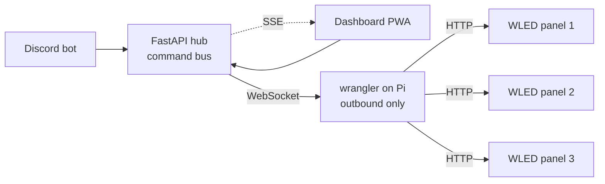

# Before I start — open your phone.

PyTexas Discord → type <code>/led text hello</code>

The matrix behind me is already listening. 
Send anything. I'll wait.

  
  

    
Scan → PyTexas Discord

    
discord.gg/mH7Fb9HE

  

(Yes, strangers get to heckle me for the next 5 minutes. That's the point.)

---
layout: default
background: /img/title-bg.png
class: text-white text-center
---

# WrangLED

## We built a Discord-controlled LED matrix in 8 days.
## Most of it worked.

  
  

    
<b>Jim Vogel</b> — <code>@CowboyQuant</code> on Discord

    
w/ Jesse Flippen · PyTexas 2026

  

---
layout: image-right
image: /img/conference.jpg
class: !text-left
---

# The ask

> *"What if virtual attendees could **heckle us** with the LEDs?"*

- **Apr 2** — idea sparked at the DFW Pythoneers meetup
- **Apr 6** — hardware arrives in a flurry of Amazon boxes
- **Apr 17** — demo on stage at PyTexas

Fifteen days. No pressure.

---
layout: image
image: /img/hero-panels.jpg
class: text-white
---

# First light 🔥

2:17 AM. A kitchen table somewhere in DFW. The PSU held.

Only one panel lit up. <i>"Must be your wiring."</i> &nbsp;Reader, it was a config flag.

---
layout: image-left
image: /img/build-night.png
class: !text-left
---

# Two Pythonistas. One Discord server.

- Met **once** — at the DFW Pythoneers meetup where this idea was born
- Built the **entire project** over Discord. No calls. No meetings. Just chat.
- Two kitchens. Two soldering irons. Two separate rigs.
- Day jobs by day. Pi hacking by night.

In theory, both rigs worked.

---
layout: default
background: /img/architecture-bg.png
class: text-white
---

# Architecture

<v-clicks>

- **Three moving parts:** WLED firmware · `wrangler` on the Pi · `api` hub.
- **The Pi dials home.** Opening a port on conference Wi-Fi is a dare, not a plan.
- **🏆 Contracts decided up front paid for themselves every single day.**

</v-clicks>

---
layout: image-right
image: /img/numbers-bg.png
class: !text-left
---

# The numbers & the scars

- **8 days · 165 commits · 3 panels · 0 face-to-face meetings**
- **70 commits on a single Monday.** *I have a day job. Allegedly.*
- 🛑 **`/panic`** — shipped ~4 min after a stranger discovered `/led text`
- 🤖 **Discord's 25-choice limit** — autocomplete, deployed live
- 📡 **Retry-on-Wi-Fi-chaos** — conference halls hate TCP
- 🧵 **Async fan-out** — one thread can't serve Discord *and* three WLEDs

---
layout: image-left
image: /img/friday-morning.png
class: !text-left
---

# Friday, 9 AM. Same room, finally.

- First time in the **same room** working on this thing
- The handshake included a **screwdriver**
- Two rigs + one deployment = **frantic config**
- Conference Wi-Fi: round one
- Time pressure turns every bug into a 10-minute bug

"In theory, both rigs worked."

— me, 8 hours before this talk, lying confidently

---
layout: image
image: /img/thanks-bg.png
class: text-white text-center
---

# Try it. Right now.

PyTexas Discord → type <code>/led text</code> anything

The matrix is behind me. It's watching.

  

    
    

      
Find me: <code>@CowboyQuant</code>

      
green cowboy logo

    

  

  

    
    

      
The code

      
github.com/JesseFlip/ wrangled-dashboard

    

  

Thanks <b>Jesse</b> 👋 · the PyTexas crew · everyone pointing an LED at me right now.

